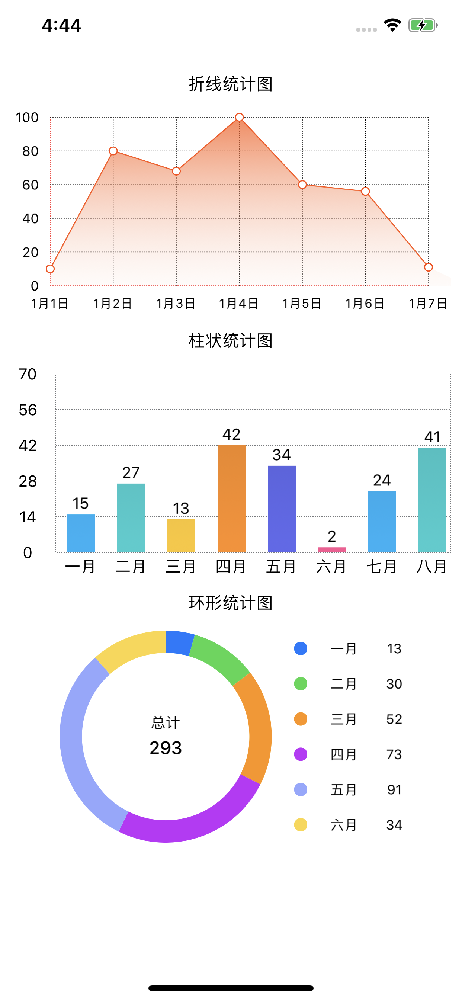

# FBYDataDisplay-iOS

<div align=center>
	
</div>

## 一：介绍

在项目中遇到数据展示需求时，往往会通过，以列表的形式展示出数据或者以表格的形式展示。但是并不能直观的观察数据的变化，如果通过图表的形式来展示，就可以更快捷的获取到数据变化情况。

图表展示的方式大致分为折线图、柱状图、饼状图等等，那么如何码出一个高颜值原生折线图呢？

##### 关注 【网罗开发】微信公众号
**网罗天下方法，方便你我开发**，更多iOS技术干货等待领取，所有文档会持续更新，欢迎关注一起成长！

下面来介绍一下如何使用。

## 二：项目展示

运行后的展示截图如下：


## 三： 折线统计图实现思路分析

实现折线图的核心代码是下面四个类：
* FBYLineGraphBaseView
* FBYLineGraphContentView
* FBYLineGraphColorView
* FBYLineGraphView
下面针对这四个类实现做一个详细的流程分析。

#### 1. 折线图基础框架实现(FBYLineGraphBaseView类)

折线图基础框架包括Y轴刻度标签、X轴刻度标签、与x轴平行的网格线的间距、网格线的起始点、x 轴长度、y 轴长度，代码如下：

```
#import <UIKit/UIKit.h>

@interface FBYLineGraphBaseView : UIView

//Y轴刻度标签
@property (nonatomic, strong) NSArray *yMarkTitles;

//X轴刻度标签
@property (nonatomic, strong) NSArray *xMarkTitles;

// 与x轴平行的网格线的间距
@property (nonatomic, assign) CGFloat xScaleMarkLEN;

//网格线的起始点
@property (nonatomic, assign) CGPoint startPoint;

//x 轴长度
@property (nonatomic, assign) CGFloat yAxis_L;

//y 轴长度
@property (nonatomic, assign) CGFloat xAxis_L;

//绘图
- (void)mapping;

//更新做标注数据
- (void)reloadDatas;

@end
```

#### 2. 折线图数据内容显示(FBYLineGraphContentView类)

折线图数据内容显示是继承FBYLineGraphBaseView类进行实现，其中主要包括，X轴最大值、数据内容来实现，代码如下：
```
#import <UIKit/UIKit.h>
#import "FBYLineGraphBaseView.h"
@interface FBYLineGraphContentView : FBYLineGraphBaseView

@property (nonatomic, strong) NSArray *valueArray;
@property (nonatomic, assign) CGFloat maxValue;

//绘图
- (void)mapping;

//更新折线图数据
- (void)reloadDatas;
@end
```
#### 3. 折线图颜色控制类(FBYLineGraphColorView类)

折线图颜色控制类主要控制选中远点边框宽度和整体布局颜色，代码如下：
```
#import <UIKit/UIKit.h>

@interface FBYLineGraphColorView : UIView

//颜色设置
@property (nonatomic, assign) CGFloat borderWidth;
@property (nonatomic, assign) UIColor *borderColor;

- (instancetype)initWithCenter:(CGPoint)center radius:(CGFloat)radius;

@end
```
#### 4. 折线图核心代码类(FBYLineGraphView类)

折线图核心代码类主要给引用类提供配置接口和数据接口，其中包括表名、Y轴刻度标签title、Y轴最大值、X轴刻度标签的长度（单位长度）、设置折线图显示的数据和对应X坐标轴刻度标签，代码如下：

```
#import <UIKit/UIKit.h>

@interface FBYLineGraphView : UIView

//表名
@property (nonatomic, strong) NSString *title;

//Y轴刻度标签title
@property (nonatomic, strong) NSArray *yMarkTitles;

//Y轴最大值
@property (nonatomic, assign) CGFloat maxValue;

//X轴刻度标签的长度（单位长度）
@property (nonatomic, assign) CGFloat xScaleMarkLEN;

/**
 *  设置折线图显示的数据和对应X坐标轴刻度标签
 *
 *  @param xMarkTitlesAndValues 折线图显示的数据和X坐标轴刻度标签
 *  @param titleKey             标签（如:9月1日）
 *  @param valueKey             数据 (如:80)
 */
- (void)setXMarkTitlesAndValues:(NSArray *)xMarkTitlesAndValues titleKey:(NSString *)titleKey valueKey:(NSString *)valueKey;

- (void)mapping;
- (void)reloadDatas;
@end
```

## 四： 柱状图实现思路分析

实现柱状图的核心代码是 FBYBarChartView 类，基础框架包括文字数组、树值数组、渐变色数组、标注值、间距、滑动、渐变方向等代码如下：

```
///文字数组
@property (nonatomic, strong) NSArray *titleArray;
///数值数组
@property (nonatomic, strong) NSArray *valueArray;
///渐变色数组
@property (nonatomic, strong) NSArray *colorArray;
///渐变色数组所占位置
@property (nonatomic, strong) NSArray *locations;
///单色数组
@property (nonatomic, strong) NSArray *singleColorArray;
///标注值
@property (nonatomic, strong) UIColor *markTextColor;
@property (nonatomic, strong) UIFont *markTextFont;
///参照线颜色
@property (nonatomic, strong) UIColor *xlineColor;
///设置标注值Label的旋转角度，效果原因只在竖直柱状图时有效
@property (nonatomic, assign) CGFloat labelRotation;

///如果要图表可以滑动设置的偏移值，横向柱状图时为水平滑动，竖向柱状图时为垂直滑动
///不需要滑动则不设置即可
@property (nonatomic, assign) CGFloat contentValue;
///默认会自动计算柱状图宽度和间隔 如果要设置 请两个属性一起设置
///单个柱宽度
@property (nonatomic, assign) CGFloat barWidth;
///间距
@property (nonatomic, assign) CGFloat margin;
///可滑动时默认显示的初始偏移距离，默认不偏移
@property (nonatomic, assign) CGPoint contentOffset;
///渐变的方向，默认垂直
@property (nonatomic, assign) GradientType gradientType;
```

实现核心源码如下:

```
- (void)drawLine{
    CAShapeLayer *lineLayer= [CAShapeLayer layer];
    _lineLayer = lineLayer;
    [lineLayer setLineDashPattern:[NSArray arrayWithObjects:[NSNumber numberWithInt:1], [NSNumber numberWithInt:1.5], nil]];
    lineLayer.fillColor = [UIColor clearColor].CGColor;
    lineLayer.lineWidth = 0.5f;
    lineLayer.strokeColor = [UIColor grayColor].CGColor;
    _height = self.frame.size.height;
    _width = self.frame.size.width;
    _barMargin = 20.0;
    _lineHeight = _height - 20;
    if (_type == OrientationHorizontal) {
        _x = 60;
        _y = 0;
        _lineWidth = _width - _x - 20;
    } else{
        _x = 40;
        _y = 20;
        _lineWidth = _width - _x;
    }
    
    //参照线
    UIBezierPath *linePath = [UIBezierPath bezierPath];
    
    [linePath moveToPoint:CGPointMake(_x,_y)];
    [linePath addLineToPoint:CGPointMake(_x + _lineWidth,_y)];
    [linePath addLineToPoint:CGPointMake(_x + _lineWidth,_lineHeight)];
    [linePath addLineToPoint:CGPointMake(_x,_lineHeight)];
    [linePath addLineToPoint:CGPointMake(_x,_y)];
    if (_type == OrientationHorizontal) {
        for (int i = 1; i < _markLabelCount; i++) {
            [linePath moveToPoint:CGPointMake(_x + _lineWidth / _markLabelCount * i, 0)];
            [linePath addLineToPoint:CGPointMake(_x + _lineWidth / _markLabelCount * i,_lineHeight)];
        }
    } else{
        for (int i = 1; i < _markLabelCount; i++) {
            [linePath moveToPoint:CGPointMake(_x, (_lineHeight - _y) / _markLabelCount * i +_y)];
            [linePath addLineToPoint:CGPointMake(_x + _lineWidth,(_lineHeight - _y) / _markLabelCount * i + _y)];
        }
    }
    lineLayer.path = linePath.CGPath;
    [self.layer addSublayer:lineLayer];
    
}
```

## 五： 环形图实现思路分析

实现环形图的核心代码是 FBYRingChartView 类，基础框架包括中心文字、标注值、颜色数组、值数组、图表宽度等代码如下：

```
///中心文字
@property (nonatomic, copy) NSString *title;
@property (nonatomic, weak) UIColor *titleColor;
@property (nonatomic, weak) UIFont *titleFont;
///标注值
@property (nonatomic, weak) UIColor *valueColor;
@property (nonatomic, weak) UIFont *valueFont;
///颜色数组
@property (nonatomic, strong) NSArray *colorArray;
///值数组
@property (nonatomic, strong) NSArray *titleArray;
@property (nonatomic, strong) NSArray *valueArray;
///图表宽
@property (nonatomic, assign) CGFloat ringWidth;
```

实现核心源码如下:

```
-(void)drawChart
{
    if (_markViewDirection) {
        CGFloat x = 0;
        CGFloat y = 0;
        CGFloat mvWidth = 100;
        CGFloat mvHeight = 12;
        CGFloat margin = 0;
        _mvArray = [NSMutableArray array];
        for (int i = 0; i < _valueArray.count; i++) {
            int indexX = i % 2;
            int indexY = i / 2;
            if (_markViewDirection == MarkViewDirectionLeft) {
                margin = (_radius * 2 - 12 * _valueArray.count) / 5;
                x = _width * 0.75 - _radius - mvWidth - 30;
                y = (_height - _radius * 2) / 2 + (margin + mvHeight) * I;
            } else if (_markViewDirection == MarkViewDirectionRight){
                margin = (_radius * 2 - 12 * _valueArray.count) / 5;
                x = _width * 0.25 + _radius + 30;
                y = (_height - _radius * 2) / 2 + (margin + mvHeight) * I;
            } else if (_markViewDirection == MarkViewDirectionTop){
                x = indexX == 0 ? _width / 2 - 15 - mvWidth : _width / 2 + 15;
                y = _height * 0.75 - _radius - 30 - (_valueArray.count / 2) * 12 - (_valueArray.count / 2 - 1) * 10 + indexY * (12 + 10);
            }  else if (_markViewDirection == MarkViewDirectionBottom){
                x = indexX == 0 ? _width / 2 - 15 - mvWidth : _width / 2 + 15;
                y = _height * 0.25 + _radius + 30 + indexY * (12 + 10);
            }
            
            UIView *view = [[UIView alloc] initWithFrame:CGRectMake(x, y, 100, 12)];
            [self addSubview:view];
            view.alpha = 0;
            [_mvArray addObject:view];
            
            UIView *colorV = [[UIView alloc] initWithFrame:CGRectMake(0, 0, 12, 12)];
            [view addSubview:colorV];
            colorV.backgroundColor = _colorArray[I];
            colorV.layer.cornerRadius = 6;
            colorV.layer.masksToBounds = YES;
            
            UILabel *tLabel = [[UILabel alloc] initWithFrame:CGRectMake(25, 0, 40, 12)];
            [view addSubview:tLabel];
            tLabel.text = _titleArray[I];
            tLabel.font = [UIFont systemFontOfSize:12];
            tLabel.textColor = [UIColor blackColor];
            tLabel.textAlignment = NSTextAlignmentCenter;
            
            UILabel *vLabel = [[UILabel alloc] initWithFrame:CGRectMake(70, 0, 40, 12)];
            [view addSubview:vLabel];
            vLabel.text = [NSString stringWithFormat:@"%@",_valueArray[I]];
            vLabel.font = [UIFont systemFontOfSize:12];
            vLabel.textColor = [UIColor blackColor];
            vLabel.textAlignment = NSTextAlignmentCenter;
        }
    }
    [_layerArray enumerateObjectsUsingBlock:^(CAShapeLayer *  _Nonnull obj, NSUInteger idx, BOOL * _Nonnull stop) {
        CABasicAnimation *ani = [CABasicAnimation animationWithKeyPath : NSStringFromSelector ( @selector (strokeEnd))];
        ani.fromValue = @0;
        ani.toValue = @1;
        ani.duration = 1.0;
        [obj addAnimation:ani forKey:NSStringFromSelector(@selector(strokeEnd))];
    }];
    
    [_mvArray enumerateObjectsUsingBlock:^(UIView *  _Nonnull obj, NSUInteger idx, BOOL * _Nonnull stop) {
        [UIView animateWithDuration:1 animations:^{
            obj.alpha = 1;
        }];
    }];
}
```

## 六：如何在项目中使用

#### 1. 下载源码

在demo中找到FBYLineGraph文件夹，将文件夹拖入自己的项目中。

#### 2. 代码引用

2.1 首先在项目中需要使用的页面引用

```
#import "FBYLineGraphView.h"
#import "FBYBarChartView.h"
#import "FBYRingChartView.h"
```

2.2 初始化统计图

```
// 折线统计图
[self lineGraphView];
// 柱状统计图
[self barChartView];
// 环形统计图
[self ringChartView];
```

2.3 折线图设置属性添加内容

```
- (void)lineGraphView {
    // 初始化折线图
    FBYLineGraphView *LineGraphView = [[FBYLineGraphView alloc] initWithFrame:CGRectMake(10, 0, SCREEN_WIDTH - 20, 220)];
    // 设置折线图属性
    LineGraphView.title = @"折线统计图"; // 折线图名称
    LineGraphView.maxValue = 100;   // 最大值
    LineGraphView.yMarkTitles = @[@"0",@"20",@"40",@"60",@"80",@"100"]; // Y轴刻度标签
    [LineGraphView setXMarkTitlesAndValues:@[@{@"item":@"1月1日",@"count":@10},@{@"item":@"1月2日",@"count":@80},@{@"item":@"1月3日",@"count":@68},@{@"item":@"1月4日",@"count":@100},@{@"item":@"1月5日",@"count":@60},@{@"item":@"1月6日",@"count":@56},@{@"item":@"1月7日",@"count":@11}] titleKey:@"item" valueKey:@"count"]; // X轴刻度标签及相应的值
    //LineGraphView.xScaleMarkLEN = 60;
    //设置完数据等属性后绘图折线图
    [LineGraphView mapping];
    [self.baseScrollView addSubview:LineGraphView];
}
```
2.4 柱状图设置属性添加内容

```
// 柱状统计图
- (void)barChartView {
    UILabel *titleLab = [[UILabel alloc] initWithFrame:CGRectMake(0, 235, CGRectGetWidth(self.view.frame), 20)];
    titleLab.text = @"柱状统计图";
    titleLab.textColor = [UIColor blackColor];
    titleLab.font = [UIFont systemFontOfSize:15];
    titleLab.textAlignment = NSTextAlignmentCenter;
    [self.baseScrollView addSubview:titleLab];
    ///渐变色
    NSArray *color1 = @[[self colorWithHexString:@"#07B2F6" alpha:1],[self colorWithHexString:@"#06A0DD" alpha:1]];
    NSArray *color2 = @[[self colorWithHexString:@"#2CCDCE" alpha:1],[self colorWithHexString:@"#27B8B9" alpha:1]];
    NSArray *color3 = @[[self colorWithHexString:@"#FCC627" alpha:1],[self colorWithHexString:@"#E2B123" alpha:1]];
    NSArray *color4 = @[[self colorWithHexString:@"#FF8E1F" alpha:1],[self colorWithHexString:@"#E6801B" alpha:1]];
    NSArray *color5 = @[[self colorWithHexString:@"#606AED" alpha:1],[self colorWithHexString:@"#565FD5" alpha:1]];
    NSArray *color6 = @[[self colorWithHexString:@"#FC5592" alpha:1],[self colorWithHexString:@"#E34C83" alpha:1]];
    FBYBarChartView *bar = [[FBYBarChartView alloc] initWithFrame:CGRectMake(10, 255, SCREEN_WIDTH - 20, 200) withMarkLabelCount:6 withOrientationType:OrientationVertical];
    [self.baseScrollView addSubview:bar];
    bar.titleArray = @[@"一月",@"二月",@"三月",@"四月",@"五月",@"六月",@"七月",@"八月",@"九月",@"十月",@"十一月",@"十二月"];
    bar.valueArray = @[@"15",@"27",@"13",@"42",@"34",@"2",@"24",@"41",@"12",@"56",@"69",@"33"];
    bar.colorArray = @[color1,color2,color3,color4,color5,color6,color1,color2,color3,color4,color5,color6];
    bar.locations = @[@0.15,@0.85];
    bar.markTextColor = [UIColor blackColor];
    bar.markTextFont = [UIFont systemFontOfSize:14];
    bar.xlineColor = [self colorWithHexString:@"#4b4e52" alpha:1];
    ///不需要滑动可不设置
    bar.contentValue = 12 * 45;
    bar.barWidth = 25;
    bar.margin = 20;
    [bar drawChart];
}
```

2.5 环形图设置属性添加内容

```
// 环形统计图
- (void)ringChartView {
    UILabel *titleLab = [[UILabel alloc] initWithFrame:CGRectMake(0, 470, CGRectGetWidth(self.view.frame), 20)];
    titleLab.text = @"环形统计图";
    titleLab.textColor = [UIColor blackColor];
    titleLab.font = [UIFont systemFontOfSize:15];
    titleLab.textAlignment = NSTextAlignmentCenter;
    [self.baseScrollView addSubview:titleLab];
    NSArray *colorArray = @[[self colorWithHexString:@"#007aff" alpha:1],
                            [self colorWithHexString:@"#3ed74d" alpha:1],
                            [self colorWithHexString:@"#ff9304" alpha:1],
                            [self colorWithHexString:@"#c22efb" alpha:1],
                            [self colorWithHexString:@"#93a8ff" alpha:1],
                            [self colorWithHexString:@"#fcd640" alpha:1]];
    
    NSArray *valueArray = @[@13,@30,@52,@73,@91,@34];
    NSArray *titleArray = @[@"一月",@"二月",@"三月",@"四月",@"五月",@"六月"];
    
    FBYRingChartView *ring = [[FBYRingChartView alloc] initWithFrame:CGRectMake(60, 500, SCREEN_WIDTH - 60, 200) markViewDirection:MarkViewDirectionRight];
    [self.baseScrollView addSubview:ring];
    ring.colorArray = colorArray;
    ring.valueArray = valueArray;
    ring.titleArray = titleArray;
    ring.ringWidth = 20.0;
    ring.title = @"总计";
    [ring drawChart];
}
```

设置完上面的，一个高颜值原生折线统计图就可以使用了。
如果好用就请点赞关注，会不定期更新更多干货。更多源码可以去GitHub下载。
* [柱状图、环形图参考资料](https://github.com/xuuhan/HXCharts)
